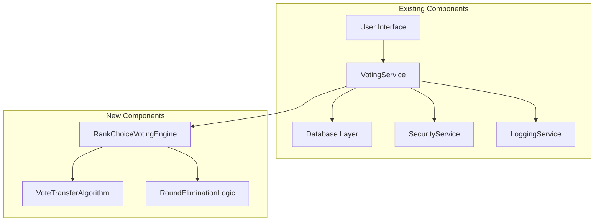
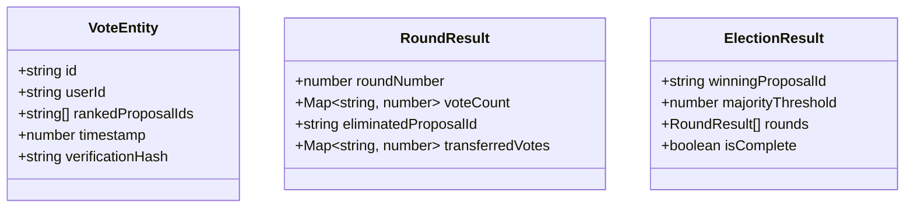
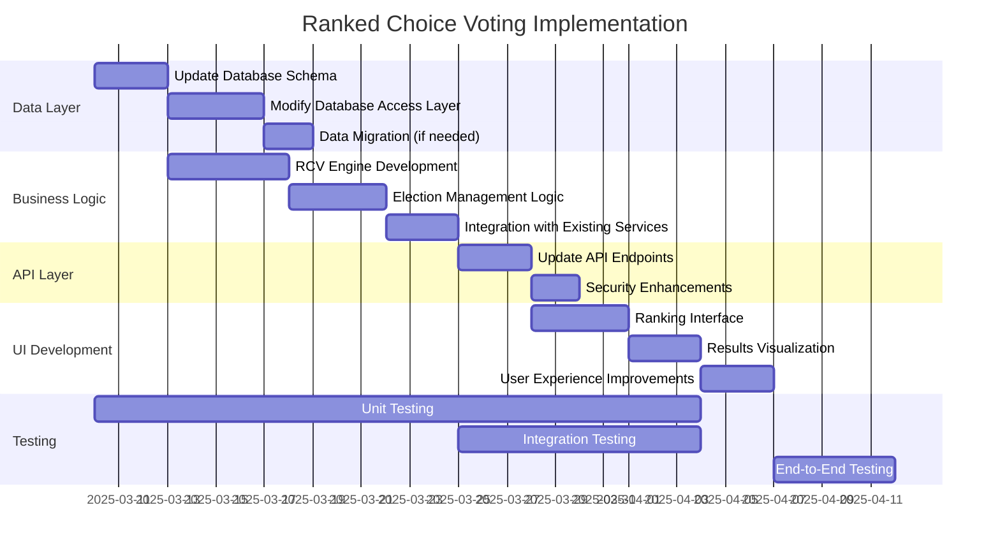

# Implementation and Test-Driven Development Plan for Ranked Choice Voting

## 1. Overview

The current implementation supports a simple majority voting system where users can cast a single vote for a proposal. To implement Ranked Choice Voting (RCV), we need to modify the existing architecture to allow users to rank their preferences and implement the necessary logic to calculate winners using the RCV algorithm.

## 2. System Architecture Update



## 3. Data Model Changes

### 3.1 Enhanced Vote Entity



## 4. Implementation Plan

### Phase 1: Core Data Structure Updates

1. **Update Database Schema**
   - Modify the `VoteEntity` structure to support ranking
   - Add new tables/collections for storing election results and round data

2. **Database Access Layer**
   - Expand CRUD operations to handle the new data structures
   - Implement data migration strategy for existing votes (if needed)

### Phase 2: RCV Algorithm Implementation

3. **Develop Ranked Choice Voting Engine**
   - Implement vote counting logic
   - Implement elimination rounds algorithm
   - Implement vote transfer mechanism

4. **Create Election Management**
   - Add functionality to start/end elections
   - Implement results calculation and storage

### Phase 3: API & Service Layer

5. **Update Voting Service**
   - Modify `voteForProposal` to accept ranked choices
   - Add methods for retrieving election status and results
   - Implement vote validation for RCV

6. **Update Security & Logging**
   - Enhance security validation for RCV votes
   - Expand logging to capture RCV-specific events

### Phase 4: User Interface

7. **Develop RCV UI Components**
   - Create drag-and-drop interface for ranking proposals
   - Implement proposal sorting mechanism
   - Add visualization for election results

8. **User Experience Enhancements**
   - Add instructions for using RCV
   - Create animations for the counting process

## 5. Test-Driven Development Plan

### 5.1 Unit Tests

#### Vote Entity Tests

```typescript
describe('RankedVoteEntity', () => {
  test('should create a valid ranked vote with multiple preferences', () => {
    // Test code
  });

  test('should validate rankings are in correct order', () => {
    // Test code
  });

  test('should reject votes with duplicate proposals', () => {
    // Test code
  });
});
```

#### RCV Algorithm Tests

```typescript
describe('RankedChoiceVotingEngine', () => {
  test('should correctly determine winner when majority achieved in first round', () => {
    // Test code with predetermined votes and expected winner
  });

  test('should correctly eliminate candidates and transfer votes', () => {
    // Test code with multiple rounds scenario
  });

  test('should handle tie scenarios according to defined rules', () => {
    // Test code with tie scenario
  });

  test('should correctly process elections with exactly two candidates', () => {
    // Test code
  });
});
```

#### Service Layer Tests

```typescript
describe('VotingService - RCV', () => {
  test('should allow user to submit ranked votes', () => {
    // Test code
  });

  test('should prevent user from voting twice in same election', () => {
    // Test code
  });

  test('should calculate and return correct election results', () => {
    // Test code
  });
});
```

### 5.2 Integration Tests

```typescript
describe('RCV Integration', () => {
  test('should correctly process votes and determine winner through multiple rounds', () => {
    // Test election with multiple voters and rounds
  });

  test('should handle large number of proposals and votes efficiently', () => {
    // Performance test with many votes
  });

  test('should maintain data consistency during election processing', () => {
    // Test for data integrity
  });
});
```

### 5.3 End-to-End Tests

```typescript
describe('RCV End-to-End', () => {
  test('should allow user to rank proposals and submit vote through UI', () => {
    // Test UI interaction
  });

  test('should display correct results and elimination rounds to users', () => {
    // Test results display
  });
});
```

## 6. Detailed Implementation Sequence

### Step 1: Update VoteEntity and Database Structure

```typescript
// Enhanced VoteEntity
export interface RankedVoteEntity {
  id: string;
  userId: string;
  rankedProposalIds: string[]; // Ordered array of proposal IDs
  timestamp: number;
  verificationHash?: string;
}

// Round result for storing interim results
export interface RoundResult {
  roundNumber: number;
  voteCount: Record<string, number>;
  eliminatedProposalId: string | null;
  transferredVotes: Record<string, number>;
}

// Overall election result
export interface ElectionResult {
  electionId: string;
  winningProposalId: string | null;
  majorityThreshold: number;
  rounds: RoundResult[];
  isComplete: boolean;
  timestamp: number;
}
```

### Step 2: Create RCV Algorithm Core

```typescript
export class RankedChoiceVotingEngine {
  /**
   * Process an election using RCV algorithm
   * @param votes Array of ranked votes
   * @param proposals Array of proposals
   * @returns Election result with all rounds
   */
  processElection(votes: RankedVoteEntity[], proposals: ProposalEntity[]): ElectionResult {
    // Implementation of RCV algorithm
    // 1. Count first-preference votes
    // 2. Check if any proposal has majority
    // 3. If not, eliminate proposal with fewest votes
    // 4. Transfer votes to next preferences
    // 5. Repeat until majority achieved
  }
  
  /**
   * Count votes for a specific round
   * @param votes Votes to count
   * @param eliminatedProposals Proposals already eliminated
   * @returns Vote counts per proposal
   */
  countVotesForRound(
    votes: RankedVoteEntity[],
    eliminatedProposals: string[]
  ): Record<string, number> {
    // Count votes, skipping eliminated proposals
  }
  
  /**
   * Find proposal to eliminate based on fewest votes
   * @param voteCounts Current vote counts
   * @returns ID of proposal to eliminate
   */
  findProposalToEliminate(voteCounts: Record<string, number>): string {
    // Find proposal with fewest votes
  }
  
  /**
   * Transfer votes from eliminated proposal
   * @param votes All votes
   * @param eliminatedProposalId Proposal being eliminated
   * @param alreadyEliminated Previously eliminated proposals
   * @returns New vote count after transfer
   */
  transferVotes(
    votes: RankedVoteEntity[],
    eliminatedProposalId: string,
    alreadyEliminated: string[]
  ): Record<string, number> {
    // Transfer votes to next preferences
  }
}
```

### Step 3: Update VotingService with RCV Support

```typescript
export class VotingService {
  // Existing methods...
  
  /**
   * Submit a ranked vote for multiple proposals
   * @param rankedProposalIds Ordered array of proposal IDs
   * @param userId The ID of the user voting
   * @returns Promise that resolves with the vote result
   */
  async submitRankedVote(
    rankedProposalIds: string[],
    userId: string
  ): Promise<{ success: boolean; voteId: string | null }> {
    // Implementation
  }
  
  /**
   * Process an election using RCV
   * @param electionId ID of the election to process
   * @returns Promise that resolves with the election results
   */
  async processRankedChoiceElection(
    electionId: string
  ): Promise<ElectionResult> {
    // Implementation
  }
  
  /**
   * Get current standings in an ongoing election
   * @param electionId ID of the election
   * @returns Promise that resolves with current results
   */
  async getCurrentElectionStandings(
    electionId: string
  ): Promise<ElectionResult> {
    // Implementation
  }
}
```

## 7. Implementation Timeline and Dependencies



## 8. Test Cases for Test-Driven Development

### 8.1 Unit Tests for RCV Algorithm

| Test Case | Input | Expected Output | Description |
|-----------|-------|----------------|-------------|
| Basic RCV First-Round Win | 3 proposals, 10 votes where Proposal A has 6 first-preferences | Proposal A wins in first round | Tests simplest case where majority is achieved immediately |
| Basic RCV Multi-Round | 3 proposals, 10 votes where no proposal has initial majority | Election processed through elimination rounds to final winner | Tests core RCV algorithm with elimination |
| Tie Handling | Votes resulting in tied proposals for elimination | Tie resolved according to defined rules | Tests tie-breaking logic |
| Empty Ballot Positions | Some voters only rank a subset of proposals | Votes correctly counted with partial rankings | Tests handling of ballots where voters don't rank all options |
| All Preferences Eliminated | Voter's all ranked proposals eliminated | Vote correctly exhausted and removed from count | Tests handling of exhausted ballots |

### 8.2 Integration Tests

| Test Case | Scenario | Verification Points | Description |
|-----------|----------|---------------------|-------------|
| Complete Election Cycle | Start election, collect votes, process results | Results match expected outcome for given votes | Tests entire election process |
| Concurrent Voting | Multiple users voting simultaneously | All votes correctly recorded and processed | Tests system under load |
| Data Persistence | Server restart during election | Election state properly recovered | Tests durability of election data |
| Security Validation | Various invalid vote attempts | System correctly rejects invalid votes | Tests security measures |

### 8.3 UI Tests

| Test Case | User Action | Expected Result | Description |
|-----------|-------------|----------------|-------------|
| Rank Selection | User drag-drops proposals to rank them | UI correctly shows and saves ranking | Tests ranking interface |
| Change Ranking | User changes their mind and updates ranking | System records updated preferences | Tests ranking modification |
| Results View | User views election results | Results page shows rounds and eliminations clearly | Tests results visualization |

## 9. Risks and Mitigation Strategies

| Risk | Impact | Likelihood | Mitigation |
|------|--------|------------|------------|
| Algorithm complexity causing bugs | High | Medium | Extensive unit testing of all algorithm edge cases |
| Performance issues with large elections | Medium | Low | Optimize algorithm and implement pagination |
| User confusion with new voting method | Medium | High | Create clear instructions and interactive tutorial |
| Data migration errors | High | Low | Comprehensive testing and rollback plan |
| Security vulnerabilities | High | Low | Security audit and penetration testing |