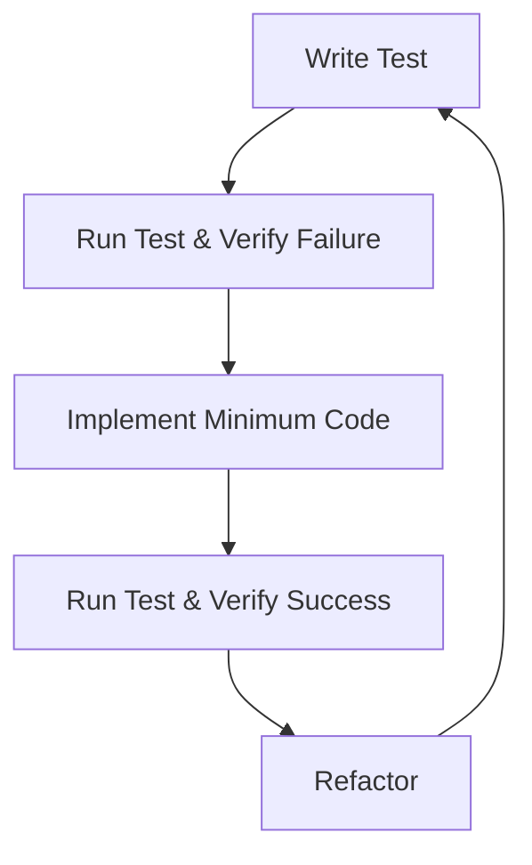

# Test-Driven Development Plan for Ranked Choice Voting

This document outlines a comprehensive test-driven development approach for implementing Ranked Choice Voting (RCV) in the Votex system. Following TDD principles, we'll write tests before implementation to guide the development process and ensure all requirements are met.

## 1. Testing Strategy Overview

Our TDD approach will follow these key principles:

1. Write tests before implementing functionality
2. Move from simple to complex test cases
3. Refactor after each passing test
4. Maintain high test coverage (target: >90%)
5. Use realistic test scenarios based on actual voting patterns



## 2. Test Levels

### 2.1 Unit Tests

Unit tests will focus on isolated components of the RCV system:

- **VoteEntity**: Test the structure and validation of ranked votes
- **RCV Algorithm**: Test each component of the algorithm independently
- **Data Access**: Test CRUD operations for the new data structures
- **Service Methods**: Test individual methods in the voting service

### 2.2 Integration Tests

Integration tests will verify interactions between components:

- **Data Flow**: Test how votes flow through the system
- **Algorithm Integration**: Test the complete RCV algorithm with the voting service
- **API Interaction**: Test API endpoints with the service layer

### 2.3 End-to-End Tests

E2E tests will validate complete user workflows:

- **Voting Process**: Test the entire process from ranking to results
- **UI Interaction**: Test the UI components for ranking and viewing results
- **Election Management**: Test creating, running, and completing elections

## 3. TDD Development Sequence

### Phase 1: Data Model and Storage

#### Test Set 1: RankedVoteEntity

```typescript
describe('RankedVoteEntity', () => {
  // Start with basic structure validation
  test('should create a valid ranked vote with required fields', () => {
    const vote = new RankedVoteEntity({
      id: 'vote1',
      userId: 'user1',
      rankedProposalIds: ['prop1', 'prop2', 'prop3'],
      timestamp: Date.now()
    });
    
    expect(vote.id).toBeDefined();
    expect(vote.rankedProposalIds.length).toBe(3);
    expect(vote.rankedProposalIds[0]).toBe('prop1');
  });
  
  // Then test validation rules
  test('should reject votes with duplicate proposals', () => {
    expect(() => {
      new RankedVoteEntity({
        id: 'vote1',
        userId: 'user1',
        rankedProposalIds: ['prop1', 'prop1', 'prop3'],
        timestamp: Date.now()
      });
    }).toThrow('Duplicate proposals are not allowed');
  });
  
  test('should accept votes with partial rankings', () => {
    const vote = new RankedVoteEntity({
      id: 'vote1',
      userId: 'user1',
      rankedProposalIds: ['prop1'],
      timestamp: Date.now()
    });
    
    expect(vote.rankedProposalIds.length).toBe(1);
  });
  
  // Test data persistence
  test('should correctly store and retrieve from database', async () => {
    const vote = new RankedVoteEntity({
      id: 'vote1',
      userId: 'user1',
      rankedProposalIds: ['prop1', 'prop2', 'prop3'],
      timestamp: Date.now()
    });
    
    await addOrUpdateItem('votes', vote);
    const retrieved = await getAllItems('votes');
    
    expect(retrieved.length).toBeGreaterThan(0);
    expect(retrieved[0].rankedProposalIds).toEqual(['prop1', 'prop2', 'prop3']);
  });
});
```

#### Test Set 2: ElectionResult and RoundResult

```typescript
describe('ElectionResult', () => {
  test('should store election results with rounds information', () => {
    const result = new ElectionResult({
      electionId: 'election1',
      winningProposalId: 'prop2',
      majorityThreshold: 5,
      rounds: [
        {
          roundNumber: 1,
          voteCount: { 'prop1': 3, 'prop2': 4, 'prop3': 2 },
          eliminatedProposalId: 'prop3',
          transferredVotes: { 'prop1': 1, 'prop2': 1 }
        },
        {
          roundNumber: 2,
          voteCount: { 'prop1': 4, 'prop2': 5 },
          eliminatedProposalId: null,
          transferredVotes: {}
        }
      ],
      isComplete: true,
      timestamp: Date.now()
    });
    
    expect(result.rounds.length).toBe(2);
    expect(result.winningProposalId).toBe('prop2');
    expect(result.isComplete).toBe(true);
  });
  
  test('should calculate if majority is reached', () => {
    const result = new ElectionResult({
      electionId: 'election1',
      rounds: [
        {
          roundNumber: 1,
          voteCount: { 'prop1': 3, 'prop2': 6, 'prop3': 2 },
          eliminatedProposalId: null,
          transferredVotes: {}
        }
      ],
      majorityThreshold: 6,
      isComplete: false,
      timestamp: Date.now()
    });
    
    expect(result.hasMajority()).toBe(true);
    expect(result.getWinner()).toBe('prop2');
  });
});
```

### Phase 2: RCV Algorithm Components

#### Test Set 3: Vote Counting Logic

```typescript
describe('RCV Vote Counting', () => {
  test('should count first preference votes correctly', () => {
    const votes = [
      { id: 'v1', userId: 'u1', rankedProposalIds: ['p1', 'p2', 'p3'], timestamp: 1 },
      { id: 'v2', userId: 'u2', rankedProposalIds: ['p2', 'p1', 'p3'], timestamp: 2 },
      { id: 'v3', userId: 'u3', rankedProposalIds: ['p1', 'p3', 'p2'], timestamp: 3 }
    ];
    
    const engine = new RankedChoiceVotingEngine();
    const results = engine.countFirstPreferenceVotes(votes);
    
    expect(results['p1']).toBe(2);
    expect(results['p2']).toBe(1);
    expect(results['p3']).toBe(0);
  });
  
  test('should identify proposal with fewest votes', () => {
    const voteCounts = { 'p1': 5, 'p2': 2, 'p3': 8 };
    
    const engine = new RankedChoiceVotingEngine();
    const eliminated = engine.findProposalToEliminate(voteCounts);
    
    expect(eliminated).toBe('p2');
  });
  
  test('should handle tie for elimination using defined rules', () => {
    const voteCounts = { 'p1': 3, 'p2': 3, 'p3': 8 };
    
    const engine = new RankedChoiceVotingEngine();
    // Assuming the rule is to use timestamp as tiebreaker
    const proposals = [
      { id: 'p1', createdAt: 1000 },
      { id: 'p2', createdAt: 900 },
      { id: 'p3', createdAt: 1100 }
    ];
    
    const eliminated = engine.breakTie(voteCounts, proposals);
    
    // Should eliminate p2 as it has earliest timestamp
    expect(eliminated).toBe('p2');
  });
});
```

#### Test Set 4: Vote Transfer Logic

```typescript
describe('RCV Vote Transfer', () => {
  test('should correctly transfer votes from eliminated proposal', () => {
    const votes = [
      { id: 'v1', userId: 'u1', rankedProposalIds: ['p3', 'p1', 'p2'], timestamp: 1 },
      { id: 'v2', userId: 'u2', rankedProposalIds: ['p3', 'p2', 'p1'], timestamp: 2 },
      { id: 'v3', userId: 'u3', rankedProposalIds: ['p1', 'p3', 'p2'], timestamp: 3 }
    ];
    
    const engine = new RankedChoiceVotingEngine();
    const transferResult = engine.transferVotes(votes, 'p3', []);
    
    expect(transferResult['p1']).toBe(1);
    expect(transferResult['p2']).toBe(1);
  });
  
  test('should handle exhausted ballots during transfer', () => {
    const votes = [
      { id: 'v1', userId: 'u1', rankedProposalIds: ['p3'], timestamp: 1 },
      { id: 'v2', userId: 'u2', rankedProposalIds: ['p3', 'p2'], timestamp: 2 }
    ];
    
    const engine = new RankedChoiceVotingEngine();
    const transferResult = engine.transferVotes(votes, 'p3', []);
    
    expect(transferResult['p2']).toBe(1);
    expect(engine.getExhaustedBallots()).toBe(1);
  });
  
  test('should skip already eliminated proposals during transfer', () => {
    const votes = [
      { id: 'v1', userId: 'u1', rankedProposalIds: ['p3', 'p1', 'p2'], timestamp: 1 }
    ];
    
    const engine = new RankedChoiceVotingEngine();
    const transferResult = engine.transferVotes(votes, 'p3', ['p1']);
    
    expect(transferResult['p1']).toBeUndefined();
    expect(transferResult['p2']).toBe(1);
  });
});
```

### Phase 3: Complete RCV Algorithm

#### Test Set 5: Full Election Processing

```typescript
describe('RCV Full Algorithm', () => {
  test('should determine winner in first round if majority achieved', () => {
    const votes = [
      { id: 'v1', userId: 'u1', rankedProposalIds: ['p1', 'p2', 'p3'], timestamp: 1 },
      { id: 'v2', userId: 'u2', rankedProposalIds: ['p1', 'p3', 'p2'], timestamp: 2 },
      { id: 'v3', userId: 'u3', rankedProposalIds: ['p1', 'p2', 'p3'], timestamp: 3 },
      { id: 'v4', userId: 'u4', rankedProposalIds: ['p2', 'p3', 'p1'], timestamp: 4 },
      { id: 'v5', userId: 'u5', rankedProposalIds: ['p3', 'p2', 'p1'], timestamp: 5 }
    ];
    
    const proposals = [
      { id: 'p1', title: 'Proposal 1', votes: 0 },
      { id: 'p2', title: 'Proposal 2', votes: 0 },
      { id: 'p3', title: 'Proposal 3', votes: 0 }
    ];
    
    const engine = new RankedChoiceVotingEngine();
    const result = engine.processElection(votes, proposals);
    
    expect(result.rounds.length).toBe(1);
    expect(result.winningProposalId).toBe('p1');
    expect(result.isComplete).toBe(true);
  });
  
  test('should process multiple rounds correctly', () => {
    const votes = [
      { id: 'v1', userId: 'u1', rankedProposalIds: ['p1', 'p2', 'p3'], timestamp: 1 },
      { id: 'v2', userId: 'u2', rankedProposalIds: ['p2', 'p1', 'p3'], timestamp: 2 },
      { id: 'v3', userId: 'u3', rankedProposalIds: ['p3', 'p1', 'p2'], timestamp: 3 },
      { id: 'v4', userId: 'u4', rankedProposalIds: ['p1', 'p3', 'p2'], timestamp: 4 },
      { id: 'v5', userId: 'u5', rankedProposalIds: ['p2', 'p3', 'p1'], timestamp: 5 }
    ];
    
    const proposals = [
      { id: 'p1', title: 'Proposal 1', votes: 0 },
      { id: 'p2', title: 'Proposal 2', votes: 0 },
      { id: 'p3', title: 'Proposal 3', votes: 0 }
    ];
    
    const engine = new RankedChoiceVotingEngine();
    const result = engine.processElection(votes, proposals);
    
    expect(result.rounds.length).toBeGreaterThan(1);
    expect(result.isComplete).toBe(true);
    
    // Verify specific round details
    const round1 = result.rounds[0];
    expect(round1.voteCount['p1']).toBe(2);
    expect(round1.voteCount['p2']).toBe(2);
    expect(round1.voteCount['p3']).toBe(1);
    expect(round1.eliminatedProposalId).toBe('p3');
    
    const round2 = result.rounds[1];
    // Verify vote transfers happened correctly
    expect(round2.voteCount['p1']).toBeGreaterThan(round1.voteCount['p1']);
  });
  
  test('should handle final tie by applying tiebreaker rule', () => {
    const votes = [
      { id: 'v1', userId: 'u1', rankedProposalIds: ['p1'], timestamp: 1 },
      { id: 'v2', userId: 'u2', rankedProposalIds: ['p2'], timestamp: 2 }
    ];
    
    const proposals = [
      { id: 'p1', title: 'Proposal 1', votes: 0, createdAt: 1000 },
      { id: 'p2', title: 'Proposal 2', votes: 0, createdAt: 900 }
    ];
    
    const engine = new RankedChoiceVotingEngine();
    const result = engine.processElection(votes, proposals);
    
    expect(result.isComplete).toBe(true);
    expect(result.winningProposalId).toBe('p2'); // p2 wins tiebreaker (earlier creation)
  });
});
```

### Phase 4: Service Layer and API

#### Test Set 6: Voting Service Integration

```typescript
describe('VotingService with RCV', () => {
  let votingService;
  
  beforeEach(() => {
    // Setup with mock DB
    const mockDb = {} as IDBDatabase;
    votingService = new VotingService(mockDb);
    
    // Reset mocks
    jest.clearAllMocks();
    (getAllItems as jest.Mock).mockClear();
    (addOrUpdateItem as jest.Mock).mockClear();
  });
  
  test('should submit ranked vote successfully', async () => {
    // Setup mocks
    (getAllItems as jest.Mock)
      .mockResolvedValueOnce([]) // No existing votes
      .mockResolvedValueOnce([
        { id: 'p1', title: 'Proposal 1', votes: 0 },
        { id: 'p2', title: 'Proposal 2', votes: 0 },
        { id: 'p3', title: 'Proposal 3', votes: 0 }
      ]); // Proposals
    
    const result = await votingService.submitRankedVote(
      ['p1', 'p2', 'p3'],
      'user123'
    );
    
    expect(result.success).toBe(true);
    expect(result.voteId).toBeDefined();
    expect(addOrUpdateItem).toHaveBeenCalledWith('votes', expect.objectContaining({
      rankedProposalIds: ['p1', 'p2', 'p3']
    }));
  });
  
  test('should prevent submitting invalid ranked vote', async () => {
    // Setup mocks
    (getAllItems as jest.Mock)
      .mockResolvedValueOnce([]) // No existing votes
      .mockResolvedValueOnce([
        { id: 'p1', title: 'Proposal 1', votes: 0 },
        { id: 'p2', title: 'Proposal 2', votes: 0 }
      ]); // Proposals
    
    // Try to submit with non-existent proposal
    const result = await votingService.submitRankedVote(
      ['p1', 'p3', 'p2'],
      'user123'
    );
    
    expect(result.success).toBe(false);
    expect(result.error).toBe('One or more proposals do not exist');
    expect(addOrUpdateItem).not.toHaveBeenCalled();
  });
  
  test('should process election and update proposal vote counts', async () => {
    // Setup mock votes and proposals
    const mockVotes = [
      { id: 'v1', userId: 'u1', rankedProposalIds: ['p1', 'p2'], timestamp: 1 },
      { id: 'v2', userId: 'u2', rankedProposalIds: ['p2', 'p1'], timestamp: 2 },
      { id: 'v3', userId: 'u3', rankedProposalIds: ['p1', 'p2'], timestamp: 3 }
    ];
    
    const mockProposals = [
      { id: 'p1', title: 'Proposal 1', votes: 0 },
      { id: 'p2', title: 'Proposal 2', votes: 0 }
    ];
    
    (getAllItems as jest.Mock)
      .mockResolvedValueOnce(mockVotes)
      .mockResolvedValueOnce(mockProposals);
    
    const result = await votingService.processRankedChoiceElection('election1');
    
    expect(result.winningProposalId).toBe('p1');
    expect(result.rounds.length).toBeGreaterThanOrEqual(1);
    
    // Should update winning proposal's vote count
    expect(addOrUpdateItem).toHaveBeenCalledWith('proposals', expect.objectContaining({
      id: 'p1',
      votes: 2
    }));
  });
});
```

### Phase 5: UI Interaction Tests

```typescript
describe('RCV UI Interaction', () => {
  test('should allow drag-drop ranking of proposals', async () => {
    // UI testing would use a framework like Testing Library or Cypress
    render(<ProposalRanking proposals={mockProposals} onSubmit={mockSubmitFn} />);
    
    // Simulate drag and drop actions to rank proposals
    const proposal1 = screen.getByTestId('proposal-item-p1');
    const proposal2 = screen.getByTestId('proposal-item-p2');
    const rankingArea = screen.getByTestId('ranking-area');
    
    // Simulate dragging operations
    fireEvent.dragStart(proposal1);
    fireEvent.drop(rankingArea);
    
    fireEvent.dragStart(proposal2);
    fireEvent.drop(rankingArea);
    
    // Click submit
    const submitButton = screen.getByText('Submit Rankings');
    fireEvent.click(submitButton);
    
    // Verify rankings were submitted correctly
    expect(mockSubmitFn).toHaveBeenCalledWith(['p1', 'p2']);
  });
  
  test('should display election results with elimination rounds', async () => {
    const mockResults = {
      rounds: [
        {
          roundNumber: 1,
          voteCount: { 'p1': 2, 'p2': 2, 'p3': 1 },
          eliminatedProposalId: 'p3',
          transferredVotes: { 'p1': 1, 'p2': 0 }
        },
        {
          roundNumber: 2,
          voteCount: { 'p1': 3, 'p2': 2 },
          eliminatedProposalId: null,
          transferredVotes: {}
        }
      ],
      winningProposalId: 'p1',
      isComplete: true
    };
    
    render(<ElectionResults results={mockResults} proposals={mockProposals} />);
    
    // Check that rounds are displayed
    expect(screen.getByText('Round 1')).toBeInTheDocument();
    expect(screen.getByText('Round 2')).toBeInTheDocument();
    
    // Check elimination is shown
    expect(screen.getByText(/proposal 3 eliminated/i)).toBeInTheDocument();
    
    // Check winner is highlighted
    const winnerElement = screen.getByText(/proposal 1/i).closest('div');
    expect(winnerElement).toHaveClass('winner');
  });
});
```

## 4. Edge Cases and Error Handling Tests

```typescript
describe('RCV Edge Cases', () => {
  test('should handle single candidate election', () => {
    const votes = [
      { id: 'v1', userId: 'u1', rankedProposalIds: ['p1'], timestamp: 1 },
      { id: 'v2', userId: 'u2', rankedProposalIds: ['p1'], timestamp: 2 }
    ];
    
    const proposals = [{ id: 'p1', title: 'Proposal 1', votes: 0 }];
    
    const engine = new RankedChoiceVotingEngine();
    const result = engine.processElection(votes, proposals);
    
    expect(result.winningProposalId).toBe('p1');
    expect(result.rounds.length).toBe(1);
  });
  
  test('should handle empty election gracefully', () => {
    const votes = [];
    const proposals = [
      { id: 'p1', title: 'Proposal 1', votes: 0 },
      { id: 'p2', title: 'Proposal 2', votes: 0 }
    ];
    
    const engine = new RankedChoiceVotingEngine();
    
    expect(() => {
      engine.processElection(votes, proposals);
    }).toThrow('Cannot process election with no votes');
  });
  
  test('should handle votes with no valid preferences remaining', () => {
    const votes = [
      { id: 'v1', userId: 'u1', rankedProposalIds: ['p3'], timestamp: 1 },
      { id: 'v2', userId: 'u2', rankedProposalIds: ['p1', 'p2'], timestamp: 2 }
    ];
    
    const proposals = [
      { id: 'p1', title: 'Proposal 1', votes: 0 },
      { id: 'p2', title: 'Proposal 2', votes: 0 }
    ];
    
    // p3 doesn't exist, so v1 has no valid preferences
    const engine = new RankedChoiceVotingEngine();
    const result = engine.processElection(votes, proposals);
    
    expect(result.winningProposalId).toBeDefined();
    expect(engine.getInvalidVotes()).toBe(1);
  });
});
```

## 5. Performance and Load Testing

```typescript
describe('RCV Performance', () => {
  test('should handle large number of votes efficiently', async () => {
    // Generate 1000 votes for 5 proposals
    const votes = [];
    const proposalIds = ['p1', 'p2', 'p3', 'p4', 'p5'];
    
    for (let i = 0; i < 1000; i++) {
      // Shuffle proposal IDs for random ranking
      const shuffled = [...proposalIds].sort(() => 0.5 - Math.random());
      votes.push({
        id: `v${i}`,
        userId: `u${i}`,
        rankedProposalIds: shuffled,
        timestamp: i
      });
    }
    
    const proposals = proposalIds.map(id => ({ 
      id, 
      title: `Proposal ${id.substring(1)}`,
      votes: 0
    }));
    
    const engine = new RankedChoiceVotingEngine();
    
    const startTime = Date.now();
    const result = engine.processElection(votes, proposals);
    const endTime = Date.now();
    
    expect(result.isComplete).toBe(true);
    expect(endTime - startTime).toBeLessThan(1000); // Should complete within 1 second
  });
  
  test('should handle parallel vote submissions', async () => {
    // Mock 20 simultaneous vote submissions
    const promises = [];
    const votingService = new VotingService({} as IDBDatabase);
    
    // Setup mocks
    (getAllItems as jest.Mock)
      .mockResolvedValue([
        { id: 'p1', title: 'Proposal 1', votes: 0 },
        { id: 'p2', title: 'Proposal 2', votes: 0 }
      ]);
    
    for (let i = 0; i < 20; i++) {
      promises.push(votingService.submitRankedVote(
        ['p1', 'p2'],
        `user${i}`
      ));
    }
    
    const results = await Promise.all(promises);
    
    // All submissions should succeed
    expect(results.every(r => r.success)).toBe(true);
    
    // Check correct number of addOrUpdateItem calls
    expect(addOrUpdateItem).toHaveBeenCalledTimes(20);
  });
});
```

## 6. Acceptance Criteria Tests

This section outlines the key acceptance criteria tests that will verify the RCV implementation meets business requirements:

1. **Basic RCV Functionality**
   - Users can rank multiple proposals in order of preference
   - Votes are correctly counted using RCV algorithm
   - A winner is determined according to RCV rules

2. **User Experience**
   - Ranking interface is intuitive and accessible
   - Users receive feedback on their rankings
   - Users can modify their rankings before submission

3. **Election Management**
   - Elections can be created, configured and closed
   - Results are calculated correctly for all rounds
   - Results are displayed in a clear, understandable format

4. **Performance and Security**
   - System handles peak voting load efficiently
   - Votes are securely recorded and cannot be tampered with
   - Users cannot vote multiple times in same election

## 7. TDD Implementation Checklist

- [ ] Set up test environment with mocking framework
- [ ] Implement data model unit tests
- [ ] Implement vote counting algorithm tests
- [ ] Implement vote transfer algorithm tests
- [ ] Implement full election processing tests
- [ ] Implement service layer integration tests
- [ ] Implement UI component tests
- [ ] Implement edge case and error handling tests
- [ ] Implement performance tests
- [ ] Verify all acceptance criteria are met

## 8. Test Coverage Goals

| Component | Coverage Target | Critical Test Scenarios |
|-----------|----------------|------------------------|
| Data Models | 100% | Validation, serialization, deserialization |
| RCV Algorithm | 100% | First round win, multiple rounds, ties, exhausted ballots |
| Service Layer | 95%+ | Vote submission, validation, processing, results |
| API Endpoints | 90%+ | Request validation, error handling, response format |
| UI Components | 85%+ | User interactions, accessibility, state management |

## 9. Testing Tools and Framework

- **Unit Tests**: Jest with TypeScript
- **Integration Tests**: Jest with supertest for API testing
- **UI Tests**: React Testing Library for component testing
- **End-to-End Tests**: Cypress for full workflow testing
- **Coverage Reporting**: Jest coverage with enforcement in CI pipeline

## 10. Continuous Integration

All tests will be integrated into the CI pipeline with these phases:

1. **Fast Feedback**: Unit tests run on every push
2. **Integration Check**: Integration tests run before merge
3. **Full Verification**: All tests including E2E run before deployment
4. **Regression Guard**: Snapshot tests to prevent UI regressions

Each phase will enforce minimum coverage requirements and zero test failures.