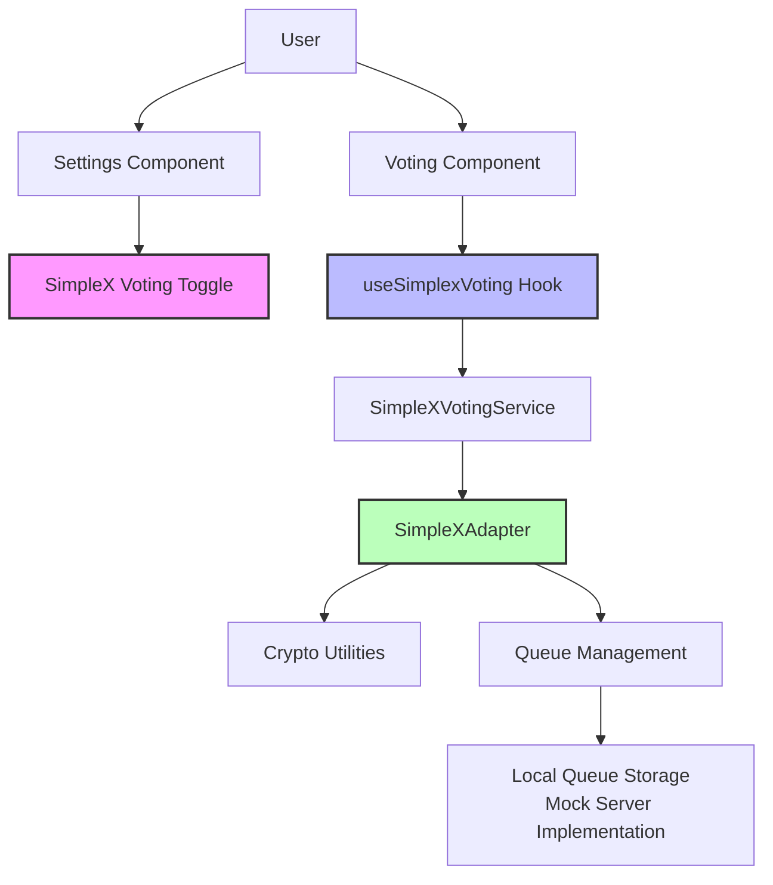
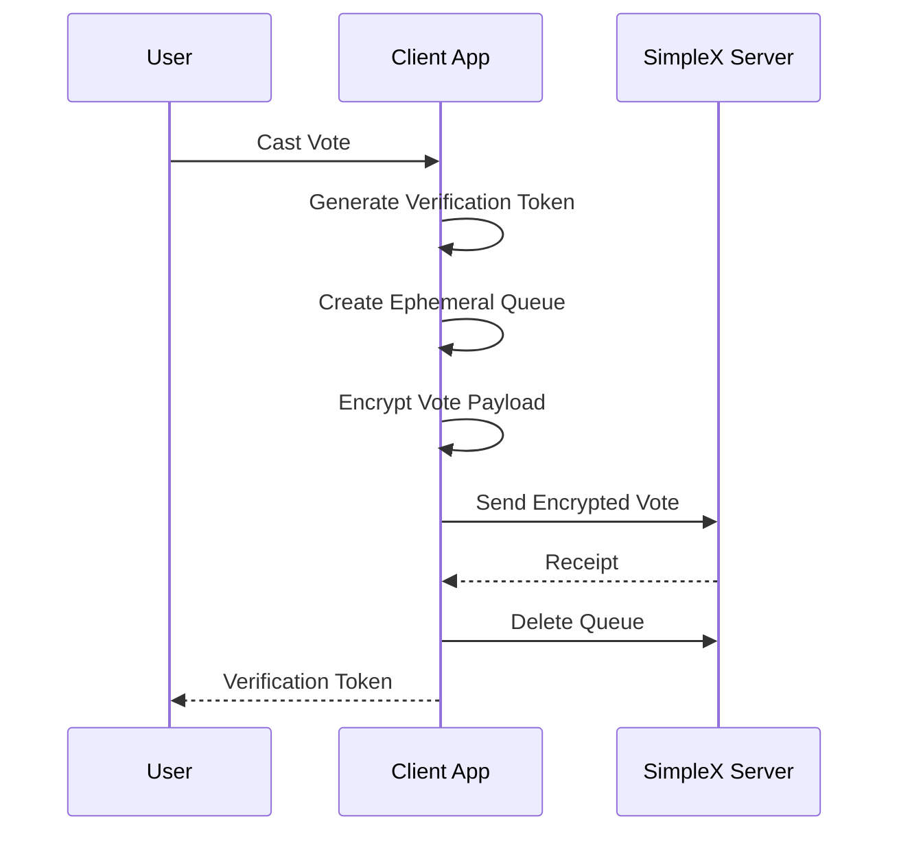

# SimpleX Protocol for Private Voting Implementation Guide

This document provides a comprehensive overview of the SimpleX protocol integration for anonymous, end-to-end encrypted voting in the Votex platform.

## Overview

The SimpleX protocol provides enhanced privacy for voting by using a queue-based messaging system that eliminates persistent identifiers and encrypts all communications. Our implementation allows users to cast votes without linking their identity to their voting choices, while still maintaining verifiability.

### Key Features

- **End-to-End Encryption**: All vote data is encrypted using AES-256-GCM
- **No Persistent Identifiers**: Voting queues are ephemeral and not linked to user identities
- **Message-Queue Based Architecture**: Vote transmission occurs through one-time message queues
- **Verifiable Voting**: Users can verify their votes were counted without revealing their identity
- **Optional Integration**: Users can enable/disable SimpleX voting via Settings

## Architecture

The SimpleX protocol implementation consists of the following key components:



### Components

1. **Settings UI Toggle**: Allows users to enable/disable SimpleX private voting
2. **React Hook (useSimplexVoting)**: Provides easy component integration
3. **SimpleXVotingService**: High-level service for casting and verifying votes
4. **SimpleXAdapter**: Core interface to the SimpleX protocol
5. **Cryptographic Utilities**: Handles encryption, decryption, and tokens
6. **Queue Management**: Manages ephemeral message queues

## Implementation Details

### Core Protocol Files

- **src/lib/simplexProtocol/types.ts**: Type definitions for the protocol
- **src/lib/simplexProtocol/crypto.ts**: Cryptographic utilities
- **src/lib/simplexProtocol/queue.ts**: Queue management
- **src/lib/simplexProtocol/adapter.ts**: Main protocol adapter
- **src/lib/simplexProtocol/votingIntegration.ts**: Integration with voting service
- **src/lib/simplexProtocol/index.ts**: Main export file

### React Integration

- **src/hooks/useSimplexVoting.ts**: React hook for easy component integration
- **src/components/Settings.tsx**: UI for enabling/disabling SimpleX voting

## How It Works

### Vote Casting Process

1. User enables SimpleX voting in Settings
2. When casting a vote, the system:
   - Creates a new ephemeral queue with a random ID
   - Generates a unique verification token
   - Encrypts the vote payload with AES-256-GCM
   - Transmits the encrypted vote through the queue
   - Returns the verification token to the user
   - Deletes the queue to prevent tracking



### Vote Verification Process

1. User provides their verification token
2. The system:
   - Creates a new verification queue
   - Sends the verification request
   - Receives the verification response
   - Deletes the verification queue
   - Returns the verification result

## Usage in Components

To use SimpleX voting in your components:

```typescript
import { useSimplexVoting } from '../hooks/useSimplexVoting';

function VotingComponent({ proposalId }) {
  const {
    isSimplexEnabled,
    isLoading,
    castSimplexVote,
    verifyVote,
    verificationToken,
    error
  } = useSimplexVoting({ proposalId });

  const handleVote = async (choice) => {
    if (isSimplexEnabled) {
      const result = await castSimplexVote(choice);
      
      if (result.success) {
        // Show verification token to user
        console.log(`Your verification token: ${result.verificationToken}`);
      }
    } else {
      // Use regular voting system
    }
  };

  const handleVerify = async (token) => {
    const isVerified = await verifyVote(token);
    // Show verification result
  };

  return (
    <div>
      {isSimplexEnabled && <div>Private voting enabled</div>}
      {/* Rest of component */}
    </div>
  );
}
```

## Security Considerations

- The current implementation uses localStorage for queue storage in the browser, which is only suitable for demonstration purposes. A production implementation would use an actual SimpleX server.
- Verification tokens should be treated securely and not stored in plain text.
- For additional security, the verification process should use blind signatures to prevent linking votes to users.

## Server Implementation Notes

The current implementation uses a mock server via localStorage. For production:

1. Set up a SimpleX relay server
2. Update the `DEFAULT_SERVER_URL` in queue.ts
3. Implement proper server-side queue management
4. Integrate with the existing voting system

## Future Enhancements

1. **Implement Actual Server**: Replace mock server with real SimpleX relay
2. **Add Blind Signatures**: Enhance anonymity with cryptographic blind signatures
3. **Add ZKP Verification**: Implement zero-knowledge proofs for vote verification
4. **Enhance UX**: Improve the user experience for verification token handling
5. **End-to-End Testing**: Add comprehensive tests for the SimpleX integration

## Conclusion

This implementation provides a strong foundation for private, anonymous voting using the SimpleX protocol. While the current implementation uses a mock server, it demonstrates the core concepts and can be extended to use a real SimpleX relay server in production.