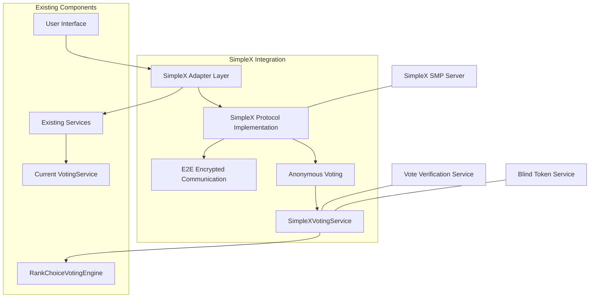

# Design Document: SimpleX Protocol for Privacy-Preserving Voting
Created: 2025-03-15
Proposal ID: VOT-2025-03-SIMPLEX

## Overview
This document outlines the design and implementation plan for integrating the SimpleX protocol into the Votex platform to enable privacy-preserving, secure voting capabilities. The SimpleX protocol's unique architecture—which operates without user identifiers and uses unique message queues for communications—makes it particularly suitable for anonymous voting systems where voter privacy and security are paramount.

The integration will enhance the current voting system by adding end-to-end encryption, elimination of voter identification metadata, and improved security against tampering while maintaining vote verifiability. This implementation will also lay groundwork for future features such as encrypted forum discussions.

## Requirements

### Functional Requirements
1. Users must be able to cast votes anonymously without revealing their identity
2. Votes must be end-to-end encrypted during transmission
3. Users must be able to verify their own votes were correctly counted without revealing their identity
4. The system must prevent double-voting while maintaining anonymity
5. The system must support both simple majority and ranked choice voting methods
6. Vote tallying must be verifiable without compromising voter privacy
7. The system must be resilient against server compromise (votes cannot be linked to voters)

### Non-Functional Requirements
1. Latency for vote operations should not exceed 2 seconds
2. The system must scale to handle at least 10,000 concurrent voters
3. Implementation must be compatible with existing database structure
4. The system should provide detailed logs for troubleshooting without compromising privacy
5. Vote verification must be user-friendly and intuitive

## Implementation Plan

### Phase 1: SimpleX Core Infrastructure (4 weeks)

1. **Set up SimpleX Server Components**
   - Install and configure SimpleX SMP server for message relay
   - Implement custom handlers for voting-specific operations
   - Create connection management for client-server communication

2. **Develop SimpleX Client Adapter**
   - Create SimpleXAdapter class to interface between the application and SimpleX protocol
   - Implement message encryption/decryption functionality
   - Build queue management for reliable message delivery

3. **Create Core Data Structures**
   ```typescript
   interface SimpleXVote {
     voteId: string; // Random identifier for this specific vote
     proposalId: string; // The proposal being voted on
     choice: number | number[]; // Single choice or ranked choices
     verificationToken: string; // For user to verify their vote
     timestamp: number;
     // No user identifier stored
   }
   
   interface EncryptedVotePacket {
     payload: string; // Encrypted vote data
     queueId: string; // One-time queue identifier
     signature?: string; // Optional cryptographic signature
   }
   ```

### Phase 2: Voting Service Integration (3 weeks)

1. **Update VotingService**
   - Create SimpleXVotingService that extends existing VotingService
   - Implement methods for creating ephemeral voting queues
   - Develop vote verification mechanism

2. **Modify Database Schema**
   - Update VoteEntity to support anonymous vote storage
   - Implement secure storage for verification tokens
   - Create indexes for efficient verification lookup

3. **Server-Side Vote Processing**
   - Implement vote validation without user identification
   - Create secure vote counting mechanism
   - Develop double-vote prevention system using blind tokens

### Phase 3: Ranked Choice Voting Support (2 weeks)

1. **Extend SimpleX Protocol for RCV**
   - Update SimpleXVote structure to support ranked choices
   - Implement secure transfer of vote rankings
   - Develop verification for multi-round elections

2. **Integrate with RCV Engine**
   - Connect SimpleXVotingService to planned RankChoiceVotingEngine
   - Implement privacy-preserving vote transfer algorithm
   - Create secure round elimination logic

### Phase 4: User Interface (3 weeks)

1. **Develop Anonymous Voting Components**
   - Create secure voting interface components
   - Implement vote verification UI
   - Build accessibility features for privacy-focused voting

2. **Security Enhancements**
   - Add client-side validation for vote integrity
   - Implement secure storage of verification tokens
   - Create privacy indicators in the UI

### Phase 5: Testing and Deployment (2 weeks)

1. **Conduct Security Audits**
   - Perform penetration testing of the voting system
   - Analyze for potential privacy leaks
   - Validate cryptographic implementations

2. **Deployment**
   - Create deployment scripts for SimpleX server components
   - Develop monitoring for anonymous voting system
   - Implement graceful fallback mechanisms

## Test-Driven Development Approach
1. Write tests that define the expected behavior
2. Implement the minimum code necessary to pass the tests
3. Refactor the code while ensuring tests continue to pass
4. Repeat until all requirements are met

### Key Test Cases

#### SimpleX Protocol Tests
```typescript
describe('SimpleXAdapter', () => {
  test('should generate unique queue IDs for each voting session', async () => {
    // Test code
  });
  
  test('should properly encrypt and decrypt vote data', async () => {
    // Test code
  });
  
  test('should successfully transmit votes through the relay', async () => {
    // Test code
  });
});
```

#### Anonymous Voting Tests
```typescript
describe('SimpleXVotingService', () => {
  test('should cast vote without storing user identifier', async () => {
    // Test code
  });
  
  test('should prevent double voting while maintaining anonymity', async () => {
    // Test code
  });
  
  test('should allow vote verification with token', async () => {
    // Test code
  });
});
```

#### Ranked Choice Voting Tests
```typescript
describe('AnonymousRankedChoiceVoting', () => {
  test('should process multi-round election while preserving voter privacy', async () => {
    // Test code
  });
  
  test('should correctly transfer votes between rounds without revealing voter identity', async () => {
    // Test code
  });
});
```

## Technical Considerations

### Risks
1. **Complexity**: Implementing SimpleX protocol introduces significant complexity compared to the current voting system.
   - Mitigation: Phased approach with thorough documentation and extensive test coverage.

2. **Performance**: End-to-end encryption and multiple server relays may introduce latency.
   - Mitigation: Implement caching strategies and optimize cryptographic operations.

3. **Integration Challenges**: Adapting existing database and service layer for anonymity.
   - Mitigation: Create adapter patterns to bridge current and new systems.

4. **Key Management**: Secure storage and handling of cryptographic keys.
   - Mitigation: Implement HSM-like functionality and secure key rotation policies.

5. **Usability vs. Privacy**: Complex verification may confuse users.
   - Mitigation: Extensive user testing and simplified verification UI.

### Benefits
1. **True Voter Privacy**: Votes cannot be linked to individual users, even by system administrators.

2. **Enhanced Security**: End-to-end encryption protects vote integrity during transmission.

3. **Tamper Resistance**: Cryptographic verification ensures votes are not altered after submission.

4. **Trust in Voting**: Users can verify their votes were counted correctly without revealing their identity.

5. **Future-Proof Architecture**: The SimpleX integration creates foundation for other privacy features like encrypted forums.

6. **Compliance**: System design aligns with emerging privacy regulations and best practices.

## Resources Required
1. **Development Resources**
   - 2 Senior Backend Developers with cryptography experience
   - 1 Frontend Developer with security UI expertise
   - 1 QA Engineer specializing in security testing

2. **Infrastructure**
   - SimpleX SMP server deployment (dedicated)
   - HSM or similar for secure key management
   - Additional storage for encrypted message queues

3. **External Support**
   - SimpleX protocol consulting (10 hours)
   - Security audit by third-party (40 hours)

## Timeline
- Estimated implementation time: 14 weeks
- Feasibility score: 7/10 (Moderate complexity but achievable)
- Impact score: 9/10 (Significant enhancement to privacy and security)

### Milestones
1. SimpleX Core Infrastructure: Weeks 1-4
2. Voting Service Integration: Weeks 5-7
3. Ranked Choice Voting Support: Weeks 8-9
4. User Interface Development: Weeks 10-12
5. Testing and Deployment: Weeks 13-14

## Status
- [ ] Tests written
- [ ] Implementation started
- [ ] Tests passing
- [ ] Implementation completed
- [ ] Code reviewed
- [ ] Deployed to production

## Technical Architecture Diagram



## Data Flow for Anonymous Voting

```mermaid
sequenceDiagram
    participant User
    participant Client
    participant SimpleXAdapter
    participant VotingRelay
    participant VoteCounter
    
    User->>Client: Cast vote
    Client->>Client: Generate verification token
    Client->>SimpleXAdapter: Encrypt vote with token
    SimpleXAdapter->>SimpleXAdapter: Create ephemeral queue
    SimpleXAdapter->>VotingRelay: Send through unique queue
    VotingRelay->>VoteCounter: Forward anonymous vote
    VoteCounter->>VoteCounter: Validate & count vote
    VoteCounter-->>Client: Return verification reference
    Client-->>User: Show verification token
    
    Note over User,VoteCounter: Later - Verification Process
    
    User->>Client: Request verification
    Client->>SimpleXAdapter: Send verification token
    SimpleXAdapter->>VotingRelay: Request through new queue
    VotingRelay->>VoteCounter: Verify vote exists
    VoteCounter-->>Client: Confirm vote counted
    Client-->>User: Display verification result